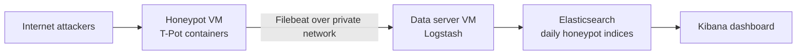

# T-Pot Honeypot Threat Intel Project

I set up a honeypot on a cloud VM, let the internet attack it, and built a pipeline that turns the raw logs into a live Kibana dashboard. I'm building this in stages and adding each one to this same repo, so the history of how it grew stays in one place.

Stage 1 is finished and documented below.

## Roadmap

| Stage | What it adds | Status |
|-------|--------------|--------|
| 1 | Honeypot VM, Elastic Stack data server, Kibana dashboard | Done |
| 2 | A detection layer built on top of the same logs | Coming soon |
| 3 | Automated alerting and response | Coming soon |

---

## Stage 1: Honeypot + Elastic Stack

### The setup

Two Vultr VMs sit in the same private network.

- **Honeypot VM** runs [T-Pot](https://github.com/telekom-security/tpotce), which is a Docker Compose stack of honeypots and network sensors. Almost the whole port range is open to the internet on purpose. Only management SSH and the T-Pot web UI are restricted to my own IP.
- **Data server VM** runs Logstash, Elasticsearch and Kibana. It has no public exposure at all.



### How an event travels

Every honeypot container writes its own JSON log. Filebeat on the honeypot VM tails those files and ships each new line across the private network to Logstash. Filebeat does no parsing. I wanted the box that gets attacked to run as little logic as possible.

Logstash does the real work. A JSON filter breaks the raw line into fields, a GeoIP filter adds country, city and coordinates for the attacker's IP, and a date filter normalizes the timestamp. The result goes into Elasticsearch as a daily index named `honeypot-YYYY.MM.DD`.

Kibana is only reachable through an SSH tunnel via the honeypot VM, so nothing about the data server is visible from outside.

### The dashboard

![Dashboard overview] (docs/images/dashboard-overview.png)

| Panel | What it shows |
|-------|---------------|
| Honeypot Activity Breakdown | Share of all logged events per sensor, including the passive tools (p0f, Suricata) |
| Interactive Honeypot Breakdown | Same idea with the passive tools filtered out, so only real attacker interaction is left |
| Attacker Origins Map | Where attacking IPs are located, plotted from the GeoIP coordinates |
| Attack Volume Over Time | Events per time bucket, which makes bursts and quiet stretches easy to spot |
| Top Attacking IP Addresses | The most persistent source IPs, ranked by event count |
| Most Attempted Credentials | A tag cloud of the usernames and passwords bots try most often |

The dashboard also has controls for the time range and for filtering to a single honeypot, so one sensor's activity can be isolated across every panel at once.

A closer look at the main panels:

**Where the attacks come from**


**Which sensors see the traffic**


**When it happens**

![Attack volume over time] (main/attacks overtime.png)

**Who keeps coming back**


### What the data showed

Snapshot from [date range]:

- Across all sensors, p0f accounted for about 67% of events and Suricata about 23%. That's expected. Both watch every packet that touches the box, while the interactive honeypots only log when something connects to their fake service.
- Once those two were filtered out, Honeytrap led with about 44%, Heralding had about 32%, and Cowrie had about 18%. My guess is that Honeytrap leads because it listens on ports that no other sensor claims, and Heralding's share reflects how many bots probe FTP, POP3 and similar protocols for weak logins. I haven't verified either explanation, so treat them as readings of the data rather than conclusions.


### Problems I ran into

**Events silently disappearing for two days.** Elasticsearch was rejecting events because the timestamps didn't match the format Logstash handed over, and nothing in the pipeline complained. Every stage looked healthy while nothing reached storage. I fixed it by making the date filter match the format each container actually emits. The lesson I took from it: check the data at the end of the pipeline, not just whether each service is running.

**Field names that weren't what I assumed.** I first wrote my filters expecting nested fields like `session.id`. The containers emit flat names like `session_id`. A Logstash filter pointed at a field that doesn't exist just skips it without an error, so the only symptom was missing enrichment. I had to compare my config against real raw events, container by container.

**A map with no dots.** Kibana Maps refused to plot the GeoIP data. The mapping check showed why: Elasticsearch had typed `lat` and `lon` as two separate `float` fields instead of one `geo_point`. The relevant part of my Logstash config is:

```
if [attacker][ip] {
  geoip {
    source => "[attacker][ip]"
    target => "[attacker][geoip]"
  }
}
```

The geoip filter already outputs the right shape. Elasticsearch just wasn't told to treat it as a point, so it guessed. A field's type can't be changed once an index exists, so the fix was an index template that applies to every new `honeypot-*` index:

```json
{
  "index_patterns": ["honeypot-*"],
  "priority": 200,
  "template": {
    "mappings": {
      "properties": {
        "attacker": { "properties": { "geoip": { "properties": { "geo": { "properties": {
          "location": { "type": "geo_point" }
        } } } } } }
      }
    }
  }
}
```

I created the next day's index early so I could confirm the mapping showed `geo_point` before any data landed in it. Older indices keep the old mapping, so historical data would need a reindex to show up on the map.

### A note on keeping the lab contained

The honeypot is expected to get compromised eventually, so the design assumes it will. The analysis box only accepts traffic from the private network, Filebeat is the single link between the two, and Kibana is never exposed. Real IPs, ports and credentials are deliberately left out of this repo.

### What I learned

Most of what I took away from this stage came from things breaking, not from things working.

- A pipeline can look healthy and deliver nothing. During the timestamp problem every service was running, and the only way I caught it was looking at what had actually landed in Elasticsearch.
- Check a real raw event before writing a filter. Guessing field names cost me a full rework.
- Logstash and Elasticsearch both fail quietly. A filter skips an event when its field is missing, and an event with an unparseable timestamp just gets dropped. Neither one raises its hand.
- Field types get decided when an index is created. Declaring them in a template up front is much cheaper than fixing them afterwards, and a fix only helps new data.

Reading the numbers matters as much as collecting them. p0f making up two thirds of all events looked odd until I remembered it logs every packet that touches the box. The more useful picture only showed up once I filtered it out and looked at the sensors that attackers actually interact with.

I also ran into least privilege in a small way. Kibana refuses to connect as the `elastic` superuser and wants a scoped service account token instead, which made me think harder about which component actually needs which level of access.

On the design side, keeping the exposed machine as simple as possible paid off. Filebeat only ships logs and everything that thinks happens on the private box, so when something broke there was far less to untangle.

---

## Stage 2: Coming soon

## Stage 3: Coming soon

---

## Author

Mohammed Aadil Khan
